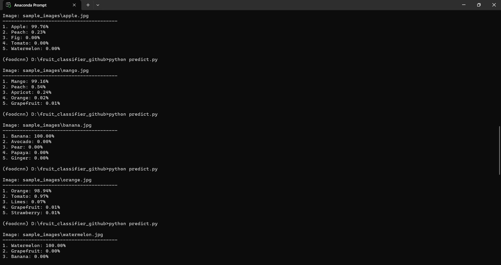
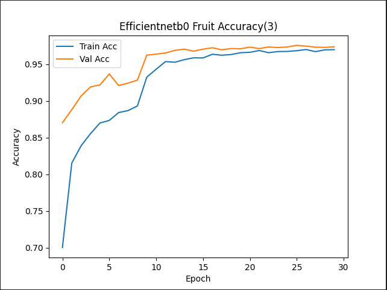
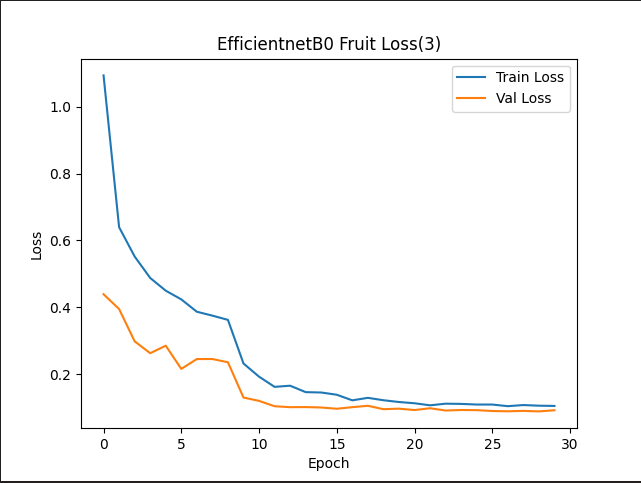
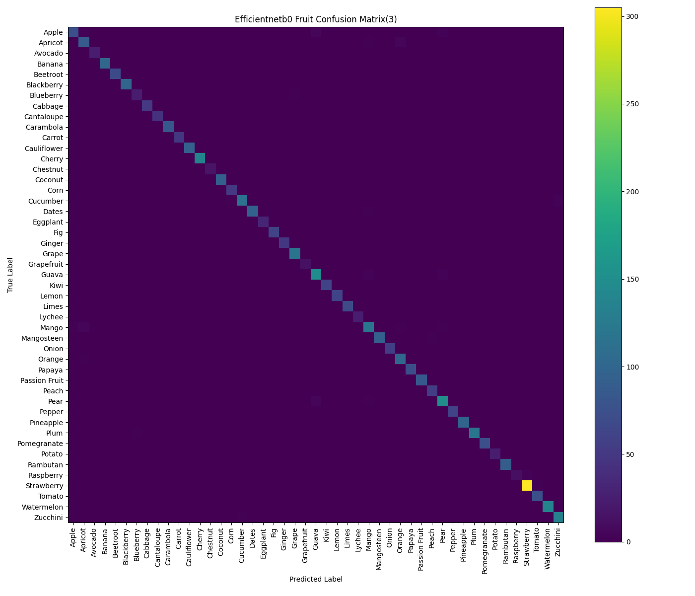
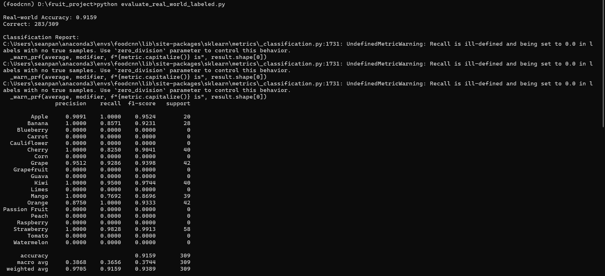

# Fruit Classifier using EfficientNet-B0

A deep learning image classification project built with PyTorch and EfficientNet-B0.

The goal of this project is to classify fruits and vegetables from images using transfer learning. The model was trained on a dataset containing 47 different classes and evaluated on both a standard test set and manually collected real-world images.

---

## Project Overview

This project uses:

* Python
* PyTorch
* EfficientNet-B0
* Transfer Learning (ImageNet pretrained weights)

The model was trained to recognize 47 fruit and vegetable classes using transfer learning from ImageNet-pretrained EfficientNet-B0, including:

Apple, Banana, Cherry, Grape, Kiwi, Mango, Orange, Strawberry, Watermelon, Pineapple, Tomato, Carrot, Cucumber, and many more.

Model weights are not included because of GitHub file size limits.

Best model:
- best_efficientnet_b0_fruit_combined_balanced(3).pth

This model represents the third major training iteration and achieved the best balance between benchmark accuracy and real-world performance.

Test Accuracy:
96.83%

Real-world Accuracy:
91.59%

---

## Dataset

Dataset statistics:

* Classes: 47
* Training Images: 18,151
* Validation Images: 3,677
* Test Images: 3,938

The dataset was split into:

* Train
* Validation
* Test

Data augmentation techniques used:

* Random Resized Crop
* Horizontal Flip
* Rotation
* Color Jitter

---

## Model

Architecture:

* EfficientNet-B0
* ImageNet Pretrained Weights

Training settings:

* Batch Size: 32
* Learning Rate: 0.001
* Optimizer: Adam
* Loss Function: CrossEntropyLoss
* Learning Rate Scheduler: ReduceLROnPlateau
* Early Stopping

---

## Results

### Test Set Performance

| Metric        | Value  |
| ------------- | ------ |
| Test Accuracy | 96.83% |

### Real-World Evaluation

To evaluate practical performance, I manually collected 309 fruit images from the internet and organized them into labeled folders.

Results:

| Metric              | Value     |
| ------------------- | --------- |
| Real-World Accuracy | 91.59%    |
| Correct Predictions | 283 / 309 |

This evaluation is more challenging than the original test dataset because the images contain different backgrounds, lighting conditions, viewpoints, and image quality.

---

## Sample Predictions

The model was tested on real-world fruit images downloaded from the internet.




## Training Progress

### Accuracy Curve



### Loss Curve



### Confusion Matrix



### Real-World Evaluation



---

## Project Structure

```text
fruit-classifier-efficientnetb0/
│
├── models/
├── results/
├── sample_images/
├── screenshots/
│
├── .gitignore
├── classes.txt
├── evaluate_real_world_labeled.py
├── LICENSE
├── make_dataset_split.py
├── model_history.md
├── predict.py
├── README.md
├── requirements.txt
└── train.py
```


---

## Installation

Clone the repository:

```bash
git clone https://github.com/seanpan-1321/Fruit-Classifier-EfficientNetB0.git
cd Fruit-Classifier-EfficientNetB0
```

Install dependencies:

```bash
pip install -r requirements.txt
```

---

## Usage

Run inference on an image:

```bash
python predict.py sample_images/apple.jpg
```

Example output:

```text
Prediction: Apple
Confidence: 99.82%
```

---

## Future Improvements

Possible future improvements include:

* Expanding to more fruit classes
* Increasing real-world image diversity
* Mobile application deployment
* Web application interface
* Nutrition estimation based on detected fruits
* Object detection for multiple fruits in a single image

---

## Author

Sean Pan

Tokyo Denki University

Information Systems Design Course

Interested in AI, Deep Learning, Computer Vision, and practical machine learning applications.
